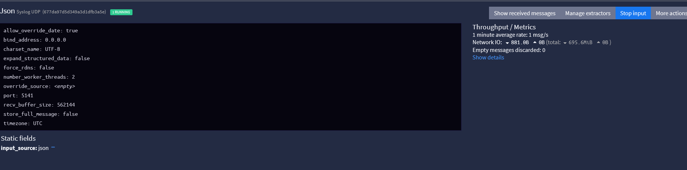
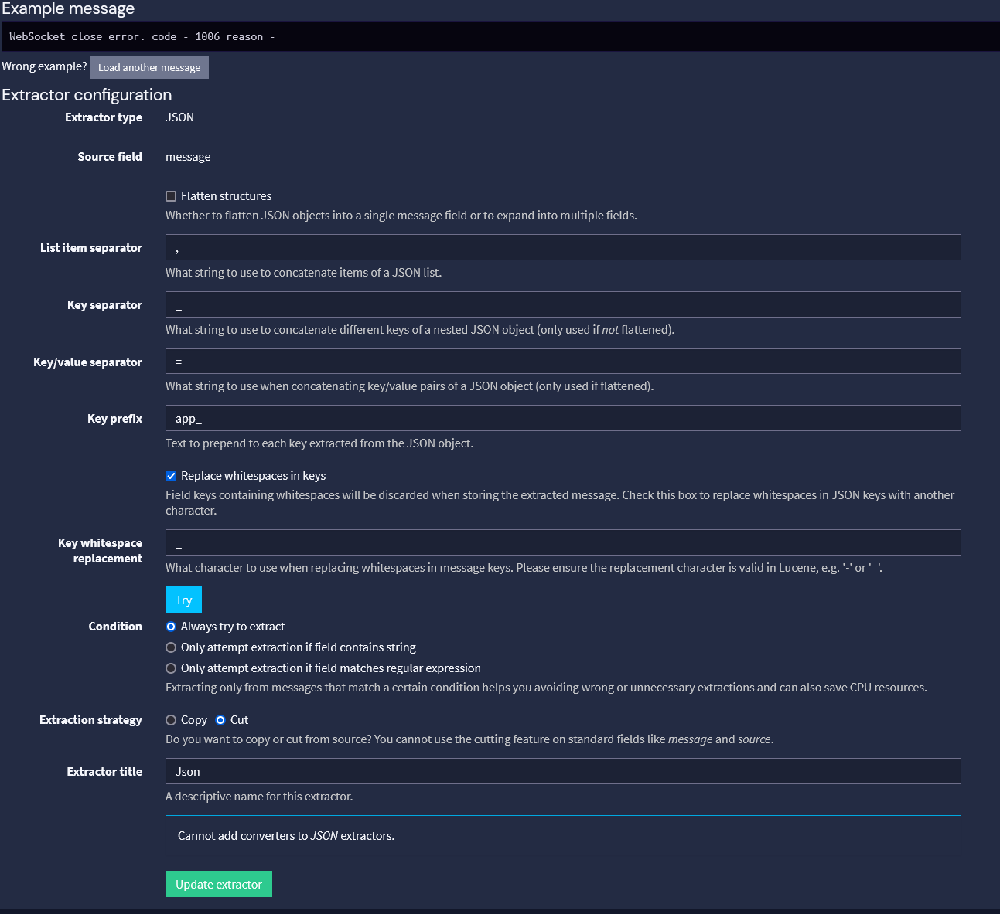
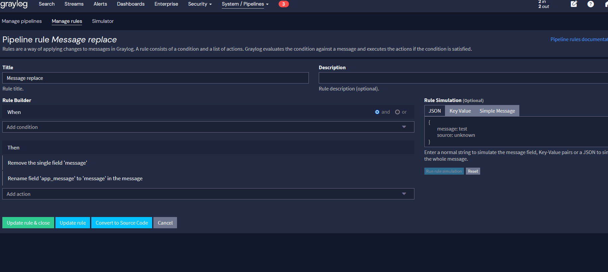
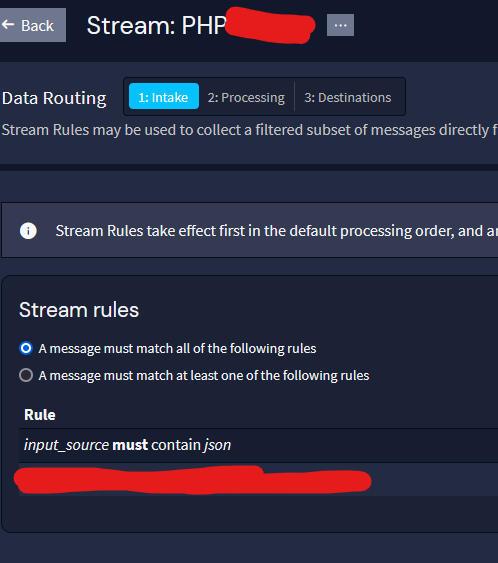
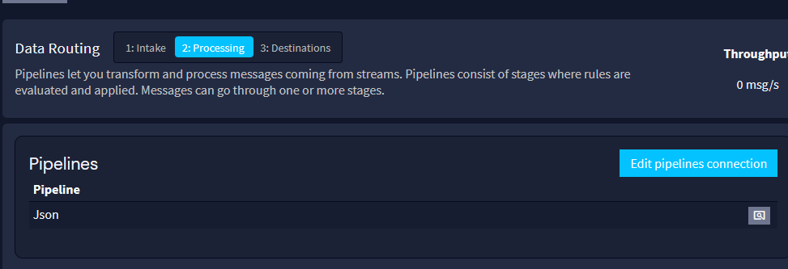

# Configuration

## Input
1) Create input with "Syslog UDP"

This dafault settings

```
allow_override_date: true
bind_address: 0.0.0.0
charset_name: UTF-8
expand_structured_data: false
force_rdns: false
number_worker_threads: 2
override_source: <empty>
port: 5141
recv_buffer_size: 562144
store_full_message: false
timezone: UTC
```

Port 5141 is default - if u want open for all, change port to another or use white list ip.

2) Add Static fields `input_source: json`

   

3) Add extractor `JSON`. Set `Key prefix` = `app_`

   


## Source
1) `Create pipeline` (/system/pipelines) and 1 stage
   

2) `Create Index Set` (Change `Rotation & Retention`)
3) `Create stream` and set `Index Set` from previos step
4) Change `Data routing`. 

Intake.

  

Processing - add Pipelines from #1 step.



Destination - as is

5) Activate stream

## over
